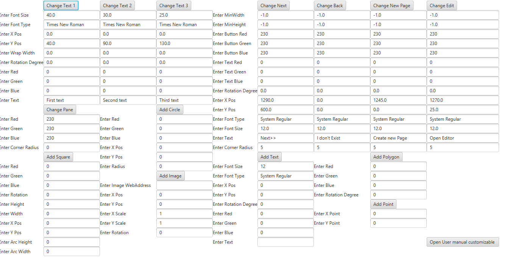
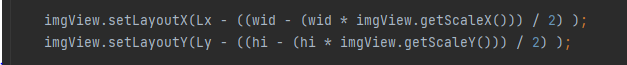

# Customizable UI
## Synopsis
This is a user interface that it highly customizable, click on open editor and the then open manual to learn how to use.
## Motivation
I made the as my final project because I was very interested in how customizable javafx is. And so I made code that allows the user to change stuff on the interface.
## How to Run
Downlad CustomMain and run on IDE.

## Code Example
I like this code because it puts the image where the user wants it to be with simple code

## Contributors

This code is Finished, however feel free to make desired improvements

contributors: Garron Haley

